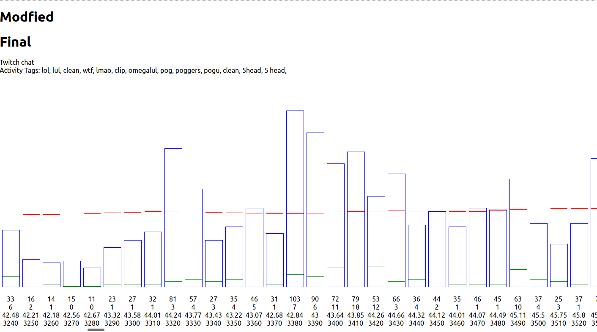

# Twitchclips

This repo is able to crawl the whole twitchchat of a streamer and shows you the activity of the chat.
You can filter via keywords and check the activity of the chat during a specific time period.

Based on some metrics of the twitchchat the timestamps of the
videoclip gets marked. Aterwards you can download this clip.


Metrics that got used:
- Engagement of the chat using sliding window method
- Specific keywords

If you want to know more of this project. Feel free to contact me. 
I will explain everything to you

This project should have create "Best of" videos and upload them to youtube
## Getting Started

```shell
$ npm install
```

update the ```twitchNames.json``` with all the streamers you want to crawl. 

To start the crawler run:
```shell
$ npm run start
```

You can show the activity bar charts via
```shell
$ npm run rs
```

at localhost:3000

At the moment you have to rename the imported json in the ```src/App.js```

```
import modified from './chatCollection/modified/750845070.json'
import final from './chatCollection/modified/750845070.json'
```

To the filename that you want to use. The filenames have the same ID as the twichvideo itself.

 

 Every bar represents a 10 secs if the twitchchat. 
 The redline defines the average activity of the twitch chat.
 The green line defines all the found keywords during the 10 secs.

 You can click on any bar and will get redirected to the clip on twitch.tv

 This UI was only for the analysis of the twitch data.


# Why did I stop?

I have heard that you need the permission of the streamer to put them into your video. Getting the best of video was not 
the challenge.
Generate the thumbnails automatically is.

# Sidenote

Everyone. Especially Recruiters. I even wrote tests for a hobby project. Tried out some Test-Driven-Development and it worked out pretty well. Checkout my pipeline. Even tried them out. Works well
